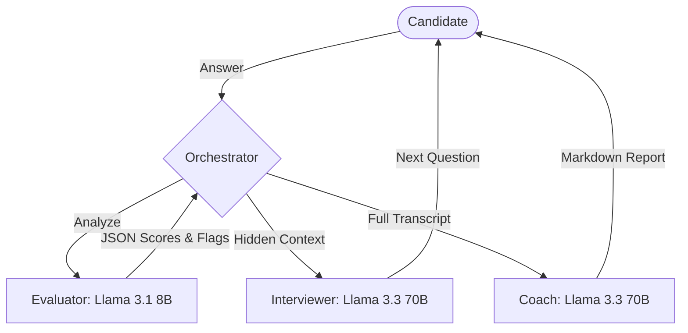

# AI Mock Interview Coach

A production-ready, multi-agent system designed to conduct realistic, adaptive mock interviews. This project leverages an orchestration layer to coordinate specialized LLM agents, providing candidates with dynamic questioning and deep, multi-dimensional feedback.

## Key Features

- **Adaptive Questioning:** The system doesn't follow a script. It probes weak answers, acknowledges strong ones, and pivots based on real-time evaluation.
- **Multi-Agent Orchestration:** Isolation of concerns between an **Interviewer**, a **Background Evaluator**, and a **Synthesis Coach**.
- **Ultra-Low Latency:** Optimized using **Groq** for near-instant inference, making the conversation feel natural.
- **Structured Analytics:** Uses JSON-mode data extraction to score candidates across 5 dimensions: Clarity, Depth, Accuracy, Communication, and Completeness.
- **Actionable Coaching:** Generates a comprehensive Markdown report including a personalized practice roadmap.

## System Architecture



### 🔄 Interaction Flow

Each turn follows a structured loop:
**Candidate Response** → **Evaluator** (JSON scoring & flags) → **Orchestrator Decision** → **Interviewer Next Question**

This loop enables adaptive questioning and real-time difficulty calibration.

## Technical Stack

- **Language:** Python 3.10+
- **Inference Engine:** [Groq](https://groq.com/) (OpenAI-compatible SDK)
- **Models:** 
    - `llama-3.3-70b-versatile` (Reasoning & Synthesis)
    - `llama-3.1-8b-instant` (High-speed JSON Extraction)
- **Utilities:** Pydantic (Data Validation), Rich (CLI UI), Python-Dotenv.

## Design Decisions & Tradeoffs

### 1. The Multi-Agent Advantage
A common failure in AI interviewers is "persona bleed"—where the model starts giving feedback *during* the interview. By separating the **Evaluator** into a hidden background process, the **Interviewer** stays 100% in character, while the system still maintains perfect analytical awareness.

### 2. Strategic Model Selection
I chose a tiered model approach:
- **Llama 3.3 70B** is used for the Interviewer and Coach because these roles require high emotional intelligence and complex reasoning.
- **Llama 3.1 8B** is used for the Evaluator. Since the Evaluator's job is specific data extraction into JSON, the smaller model provides 10x faster response times without sacrificing accuracy for this specific task.

### 3. Adaptive Turn Logic
The Orchestrator monitors "needs_followup" flags from the Evaluator. If a candidate provides a vague answer, the system dynamically extends the interview length to ensure the topic is fully explored.

### 4. Handling Real-World Messiness
The system is designed to handle imperfect user input such as:
*   **"I don't know" responses:** The system pivots to a related but different topic.
*   **Vague or partial answers:** The Evaluator flags these, triggering a guided follow-up.
*   **Off-topic replies:** Redirection to keep the interview productive.

## 🧩 Why This System Matters

Most mock interview tools rely on static question lists and binary feedback. This system goes beyond that by:
*   **Simulating real interviewer behavior** through adaptive questioning.
*   **Separating concerns** into specialized agents (reasoning, evaluation, coaching).
*   **Producing structured, multi-dimensional feedback** instead of generic responses.

This architecture makes the system closer to a real-world AI assistant rather than a simple chatbot.

## Setup & Execution

1. **Clone and Install:**
   ```bash
   pip install -r requirements.txt
   ```
2. **Configuration:** Create a `.env` file in the root directory:
   ```env
   GROQ_API_KEY=your_api_key_here
   ```
3. **Run the Coach:**
   ```bash
   python3 main.py
   ```

## Example Interview Transcripts

### 1. Strong Candidate (Senior Backend Engineer)
**Focus:** Scalability & Performance

*   **Interviewer:** "Could you describe a situation where you had to design a system to handle a 10x spike in traffic?"
*   **Candidate:** "In my last role, we had a flash-sale event. I implemented a multi-layered caching strategy using Redis and moved all non-critical writes to an asynchronous RabbitMQ queue."

**Evaluator Output (internal JSON):**
```json
{
  "scores": {
    "clarity": 9,
    "depth": 8,
    "accuracy": 10,
    "communication": 9,
    "completeness": 8
  },
  "flags": {
    "is_weak": false,
    "is_strong": true,
    "needs_followup": false,
    "is_off_topic": false
  },
  "reasoning": "Candidate correctly identified caching and message queues as primary scaling mechanisms."
}
```

*   **Interviewer (Follow-up):** "Regarding the move to asynchronous writes—how did you handle potential data consistency issues?"
*   **Candidate:** "We moved to an 'eventual consistency' model. We gave users a 'Processing' status immediately and used WebSockets to push a notification once the write was confirmed in the primary DB."
*   **Verdict:** Strong depth in distributed systems and architectural tradeoffs.

### 2. Weak Candidate (Junior Frontend Developer)
**Focus:** React & Performance

*   **Interviewer:** "If you have a large list of components rendering slowly, what are some ways you might optimize that?"
*   **Candidate:** "I would probably just use `useMemo` on everything to make sure it doesn't re-render too much."
*   **Interviewer (Follow-up):** "Using `useMemo` everywhere has overhead. How would you handle a list of 1,000 items where only one item changes?"
*   **Candidate:** "I'm not really sure, I usually just follow what the tutorials say. Maybe I'd use a different library?"
*   **Verdict:** Lacks technical depth; relies on generic advice without understanding underlying principles.

### 3. Tricky Edge Case (Pivot from "I don't know")
**Focus:** SQL to Python Pivot

*   **Interviewer:** "Could you explain the difference between a `WHERE` clause and a `HAVING` clause in SQL?"
*   **Candidate:** "I actually haven't used SQL in a while. I mostly do my analysis in Python these days. Can we talk about that instead?"
*   **Interviewer (Pivot):** "No problem! In Python, if you were cleaning a dataset in Pandas and found missing values, how would you decide whether to drop those rows or fill them?"
*   **Candidate:** "It depends on the percentage. If it's small, I'd use the median to preserve other row information. If it's a key metric, I'd have to drop the rows to avoid bias."
*   **Verdict:** Successfully handled a technical gap by pivoting to a known strength with sound reasoning.

## Future Roadmap

- [ ] **Voice Integration:** Adding Whisper (STT) and ElevenLabs (TTS) for hands-free mock calls.
- [ ] **RAG-Enhanced Questioning:** Grounding the interviewer in specific company engineering blogs or open-source documentation.
- [ ] **PDF Export:** Option to save the final coaching report as a branded PDF.

---
*Developed as part of the AI Engineer Internship Assignment.*
